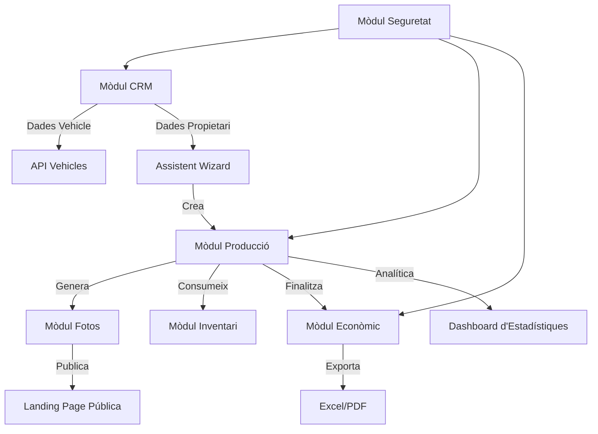

# 4.8. I 4.9. DISSENY MODULAR I ESTRUCTURA DEL PROJECTE

Aquest apartat detalla com s'ha estructurat l'aplicació per garantir que sigui escalable, segura i professional. El sistema es divideix en mòduls independents que es comuniquen entre ells per oferir una experiència fluida.

## 4.8. DISSENY MODULAR

El projecte segueix el patró **MVC (Model-Vista-Controlador)**, organitzant la lògica en mòduls funcionals clarament diferenciats:

1.  **Mòdul CRM (Clients i Vehicles)**: El cor de la base de dades. Gestiona tota la informació de contacte i la flota de vehicles del taller, integrant-se amb una API externa per a la normalització de dades.
2.  **Mòdul de Producció (Kanban)**: Gestiona el flux de treball real. Utilitza taulells visuals per separar la gestió comercial (recepció) de la feina tècnica (taller).
3.  **Mòdul d'Inventari (Materials)**: Controla l'estoc i les despeses. Inclou un sistema d'alertes visuals basat en el llindar d'estoc mínim.
4.  **Mòdul Econòmic (Finances)**: S'encarrega de transformar els treballs en pressupostos i factures amb control de cobrament.
5.  **Mòdul de Màrqueting (Galeria)**: Permet la comunicació cap a l'exterior, sincronitzant els treballs finalitzats amb la galeria pública de la Landing Page.

## 4.9. ESTRUCTURA DE DEPENDÈNCIES

A continuació es mostra el flux de dependències tècniques que hem implementat al sistema:

### Justificació del Disseny
Aquesta estructura modular garanteix que el taller pugui seguir funcionant encara que un mòdul (com el de màrqueting) no estigui actiu. A més, l'ús de **transaccions atòmiques** a l'assistent de nous treballs assegura que la informació entre el CRM i el mòdul de Producció estigui sempre sincronitzada, evitant la pèrdua de dades durant el procés de recepció del vehicle.
