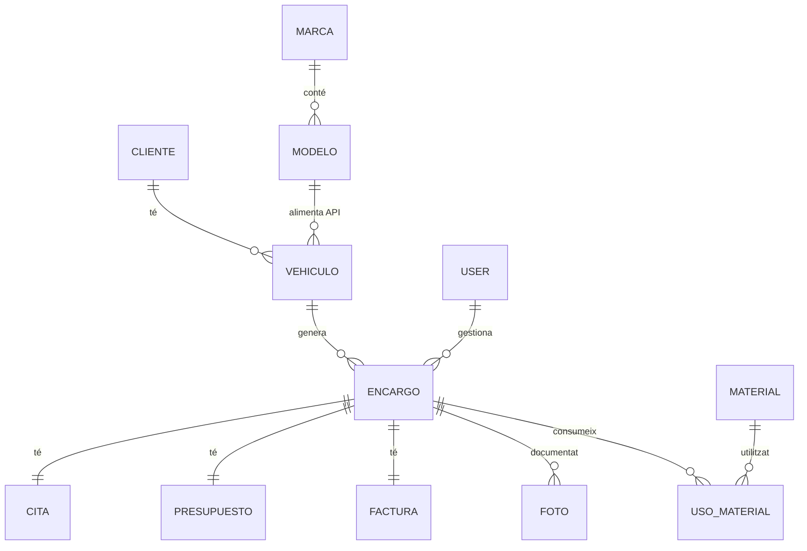

# 5. ESTRUCTURA DE LES DADES

Aquest apartat detalla el disseny i la implementació de la base de dades del sistema GestorTaller, garantint la integritat de la informació i l'escalabilitat del negoci.

## 5.1. MODEL ENTITAT-RELACIÓ DE LA BD

El diagrama Entitat-Relació defineix com es connecten les entitats principals del taller. S'ha posat especial èmfasi en la traçabilitat total des del client fins a la factura final.

### Relacions Clau:
*   **CLIENTS i VEHICLES (1:N)**: Un client pot tenir diversos vehicles, però cada vehicle pertany a un únic propietari.
*   **L’ENCÀRREC com a eix central**: Connecta els vehicles amb les cites, els pressupostos i les factures.
*   **N:M (ENCÀRRECS i MATERIALS)**: Relació gestionada mitjançant la taula `usos_materiales` per controlar quantitats i costos reals de cada treball.
*   **Autovinculació de FOTOS (1:1)**: Les fotos poden estar relacionades entre si per permetre el mode "Abans i Després".

## 5.2. MODEL RELACIONAL

A partir del disseny conceptual, el model relacional es tradueix en les següents taules principals:

*   **CLIENTS** (id, nom, cognoms, telefon, email)
*   **VEHICLES** (id, marca, modelo, matricula, color, client_id)
*   **ENCARRECS** (id, descripcio, data_entrada, data_entrega, vehicle_id, estat)
*   **CITES** (id, data, hora, encàrrec_id)
*   **PRESSUPOSTOS** (id, preu_materials, preu_hores, total, aceptat, encàrrec_id)
*   **FACTURES** (id, import_total, pagat, data_pagament, encàrrec_id)
*   **MATERIALS** (id, nom, unitat, preu_unitari, stock, stock_minimo)
*   **FOTOS** (id, ruta, tipus, relacion_id, encàrrec_id)
*   **MARQUES / MODELS** (Taules mestres per a l'ús de l'API)

## 5.3. IMPLEMENTACIÓ TÈCNICA: MIGRACIONS I API

La base de dades s'ha construït seguint els estàndards més moderns de desenvolupament web:

### Gestió de Migracions
S'ha utilitzat el sistema de **Migracions de Laravel** per a la creació i evolució de l'esquema de dades. Això ha permès:
*   **Control de versions del disseny**: Cada canvi en l'estructura està documentat cronològicament.
*   **Integritat referencial**: Definició de claus alienes (`Foreign Keys`) amb restriccions de seguretat (com l'ús de `onDelete('cascade')` quan és necessari).
*   **Soft Deletes**: Implementació d'esborrat lògic en les taules principals per garantir que la informació històrica mai es perdi realment.

### Creació de l'API de Vehicles
Per optimitzar l'entrada de dades, s'ha desenvolupat una **API interna** de vehicles:
*   S'han creat migracions i seeders per a les taules `marcas` i `modelos` amb dades oficials del sector.
*   El controlador `VehiculoDataController` exposa aquestes dades en format JSON.
*   L'assistent d'alta de treballs (Wizard) consumeix aquesta API mitjançant AJAX, garantint que la informació dels vehicles estigui sempre normalitzada i lliure d'errors tipogràfics.
